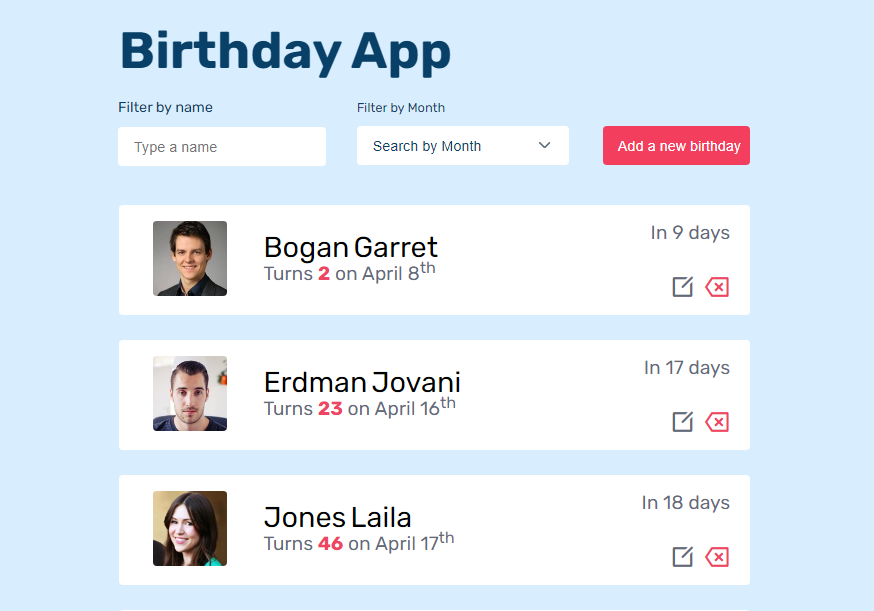

# Birthday App

## Overview

## Structure of the project

- Users could filter people with their names and their birthday months. They could filter both with names and birthday months at the same time.
- Users could add their birthday in the lists.
- User can add, delete and edit birthday from the lists.
- Every action in this app are recorded in `local storage`.

## How to use
- To clone this applications, you need to go to [GitHub](https://github.com/tsipoy/birthday-app).
- To run this application `npm start`.
- You can have a look at the [design](https://www.figma.com/file/bb1Mie5R3mUhR77PtGG8bJ/Birthday-App?node-id=0%3A1).

## Contact
- [GitHub](https://github.com/tsipoy/birthday-app)
- [Website](https://birthday-app-one.vercel.app/)